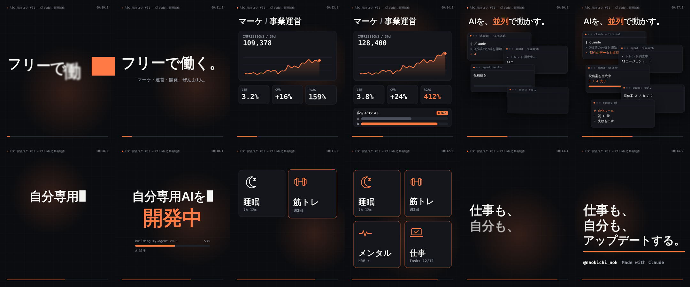

# 絵コンテ：実験ログ #01「Claudeで動画をつくってみた」

- 尺：15.0秒（30fps / 450フレーム）
- サイズ：1080×1350（4:5、Xタイムラインで最も画面を占有する縦長比率）
- 音声：なし（全シーンで文字だけで意味が通じる）
- 配色：背景 `#0B0C0F` / パネル `#14161B` / 文字 `#F4F4F2` / 補助 `#8A8F99` / アクセント `#FF7A45`（1色のみ）
- 書体：Noto Sans JP 900（見出し）、JetBrains Mono（ログ・数値）
- 全編共通：左上に `● REC 実験ログ #01 — Claudeで動画制作`、下部に進捗バーとタイムコード（「実験の記録」だと伝えつつ、最後まで見たくなる仕掛け）

| # | 時間 | 画面 | 動き | 狙い |
|---|------|------|------|------|
| 1 | 0.0–2.0 | **「フリーで働く。」**（128px）＋小さく「マーケ・運営・開発、ぜんぶ1人。」 | 0フレーム目からオレンジの帯が横切り、文字をワイプで出す。1文字ずつ下から跳ね上がる。全体はゆっくりズーム | 最初の1秒の動きでスクロールを止める |
| 2 | 2.0–5.0 | 見出し「マーケ / 事業運営」、伸びていく折れ線グラフ、KPIチップ（CTR / CVR / ROAS がカウントアップ）、広告A/Bテストのバー（B案 WIN） | グラフの線が描かれ、数字が回り、広告カードが右から入る | 「数字を見て回している人」という印象 |
| 3 | 5.0–8.0 | 見出し「AIを、並列で動かす。」、ターミナル＋AIエージェントのウィンドウが5枚 | ウィンドウが次々にポップ、中の文字がタイピングされる。最後に中央へ吸い込まれる | 情報量で「何かすごいことしてる」感 |
| 4 | 8.0–11.0 | **「自分専用AIを / 開発中」**（「開発中」はアクセント色）、下に `building my-agent v0.3` と進捗バー | タイプ打ち＋カーソル点滅、「開発中」はパンチイン。進捗は68%で止める | 完成品ではなく「途中経過」を見せるトーン |
| 5 | 11.0–13.0 | 2×2タイル：睡眠 7h12m / 筋トレ 週3回 / メンタル HRV↑ / 仕事 12/12 | 0.3秒刻みでテンポよくポップ、アクティブなタイルにアクセント枠が移動 | 発信テーマ全体を一瞬で伝える |
| 6 | 13.0–15.0 | **「仕事も、 / 自分も、 / アップデートする。」**＋ `@naokichi_nok` / `Made with Claude` | 1行ずつせり上がり、下線がスイープ。最後は静止気味にゆっくりズーム | 読後感とアカウント名の記憶 |

## 投稿文案（参考）

> Claudeに「15秒の動画つくって」と頼んでみた実験。
> HTML/CSS/JSで絵コンテ→1フレームずつ書き出し→MP4まで、ぜんぶ任せた結果がこれ。
> 修正指示は◯回。次はテンプレ化して毎週回せるか試してみます。

## キーフレーム



## 再生成の方法

```bash
# 静止画チェック（stills/ に書き出し）
node render.mjs --stills 0.5,3,6,9,12,14.9
# MP4（1080×1350 / 30fps / H.264 / 音声なし）
FFMPEG=$(python3 -c "import imageio_ffmpeg as i;print(i.get_ffmpeg_exe())") node render.mjs
```

`index.html` の `render(t)` が時刻 t の画面を決定的に描画し、`render.mjs` が Playwright で1フレームずつ撮影して ffmpeg に渡す。文言やタイミングの修正は `index.html` だけでよい。
